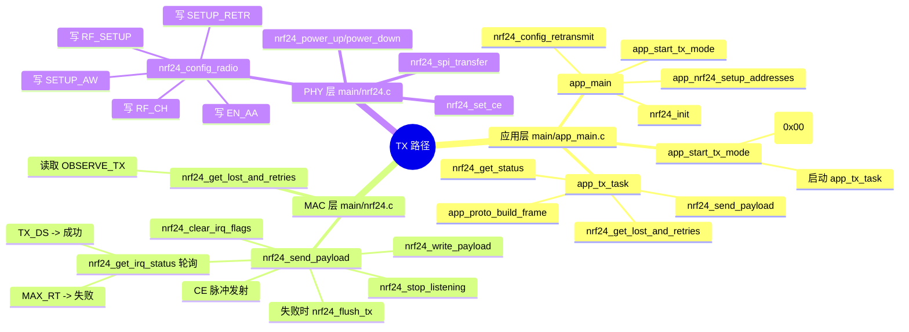
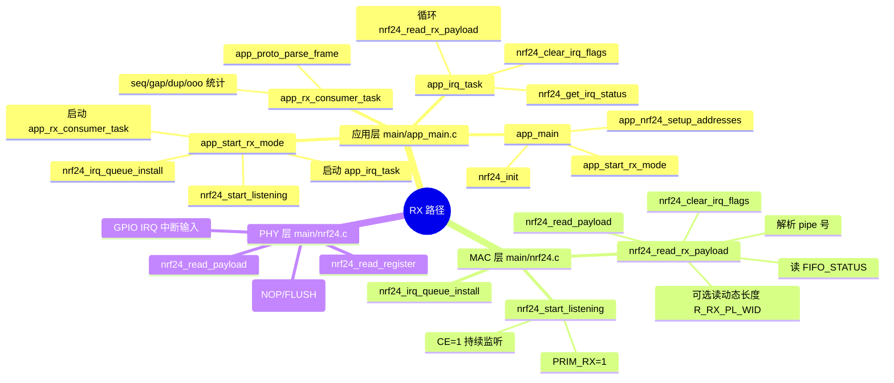

# NRF24 TX/RX 通信路径思维导图（应用层 -> MAC -> PHY）

本文面向当前仓库代码，给出两条完整收发路径：
- TX（发送）路径
- RX（接收）路径

并标出每个文件中用于测试的关键改动点。

---

## 1. 分层定义（针对本项目）

- 应用层
  - 负责命令解析、业务帧构造、统计与日志
  - 文件：main/app_main.c
- MAC 层（驱动流程层）
  - 负责发包流程、ACK/重发结果判断、IRQ/FIFO 读写策略
  - 文件：main/nrf24.c
- PHY 层（射频与寄存器层）
  - 负责信道、速率、功率、地址宽度、CRC、CE 时序
  - 文件：main/nrf24.c

注意：当前实现是“固定信道 + auto-ack + auto-retry”，不是完整 CSMA/CA。

---

## 2. TX 路径思维导图

---

## 3. RX 路径思维导图

---

## 4. 关键函数清单（按文件）

### 4.1 main/app_main.c（应用层编排）

- 启动流程
  - app_main
  - app_nrf24_setup_addresses
  - app_start_tx_mode
  - app_start_rx_mode
- TX 业务路径
  - app_tx_task
  - app_proto_build_frame
- RX 业务路径
  - app_irq_task
  - app_rx_consumer_task
  - app_proto_parse_frame

测试建议修改点：
- 发送压力与间隔
  - 修改 app_tx_task 中 burst.count / interval_ms 的处理策略
- 发送超时窗口
  - 修改调用 nrf24_send_payload 时的 wait_ticks
- 业务协议容错
  - 修改 app_proto_build_frame / app_proto_parse_frame 的字段与 CRC 校验策略
- ACK 诊断
  - 在 app_start_tx_mode 切换 nrf24_set_auto_ack_mask(0x00/0x3F)

### 4.2 main/nrf24.c（MAC + PHY 核心）

- 初始化与射频参数
  - nrf24_init
  - nrf24_config_radio
  - nrf24_config_retransmit
- TX 关键路径
  - nrf24_send_payload
  - nrf24_get_irq_status
  - nrf24_flush_tx
- RX 关键路径
  - nrf24_start_listening
  - nrf24_read_rx_payload
  - nrf24_clear_irq_flags
- 底层访问
  - nrf24_spi_transfer
  - nrf24_read_register / nrf24_write_register
  - nrf24_set_ce

测试建议修改点：
- 重发行为
  - nrf24_config_retransmit（delay_us、count）
- 发包结果判定
  - nrf24_send_payload 中轮询周期、超时逻辑、失败恢复策略
- 动态载荷容错
  - nrf24_read_rx_payload 中动态长度非法后的恢复策略
- “伪 CSMA”实验入口
  - 在 nrf24_send_payload 的装载 payload 前增加：读取 RPD -> 若忙则退避等待
  - 注意这只是实验性 LBT，不是完整 802.11 CSMA/CA

### 4.3 main/Kconfig.projbuild（测试参数开关）

- 无线参数
  - NRF24_CHANNEL
  - NRF24_DATA_RATE
  - NRF24_PA_LEVEL
  - NRF24_ADDR_WIDTH
- 链路参数
  - NRF24_AUTO_RETR_DELAY_US
  - NRF24_AUTO_RETR_COUNT
  - NRF24_TX_DISABLE_AUTO_ACK_TEST
- 运行模式
  - NRF24_ROLE_TX / NRF24_ROLE_RX
  - NRF24_MODE_TUTORIAL_DEBUG

测试建议修改点：
- 做稳定性测试：优先调低空口速率到 250K，再看 retries/gap
- 做抗干扰测试：提高发送频率并比较不同重发参数
- 做单向链路定位：先关闭 auto-ack 验证空口单向通，再恢复 auto-ack

---

## 5. 建议测试矩阵（直接可执行）

### 5.1 ACK 与重发测试

- 变量
  - auto-ack: 开/关
  - retr_count: 0/3/10/15
  - retr_delay_us: 250/750/1500
- 观察指标
  - TX: ack_ok, ack_fail, retries_sum, retries_max
  - RX: frame_ok, crc_fail, gap, dup, ooo

### 5.2 速率与稳定性测试

- 变量
  - data_rate: 250K / 1M / 2M
  - pa_level: -18/-12/-6/0 dBm
- 观察指标
  - 同样发送次数下，ack_fail 与 seq_gap 的变化

### 5.3 “监听信道”实验（非标准 CSMA）

- 修改位置
  - main/nrf24.c 的 nrf24_send_payload
- 实验逻辑
  - 发送前读 RPD
  - 若 RPD=1（疑似忙）则随机退避 N ms 后重试
- 验证方法
  - 在同信道增加干扰源，对比添加前后的 ack_fail 与 retries_sum

---

## 6. 一句话结论

本项目代码结构清晰地分为应用层编排与驱动层收发，驱动侧 MAC 机制以 ACK/自动重发为核心，PHY 通过寄存器配置完成信道与射频参数设置；如要做更深入的“信道侦听”研究，最佳切入点是 nrf24_send_payload 发送前阶段。
