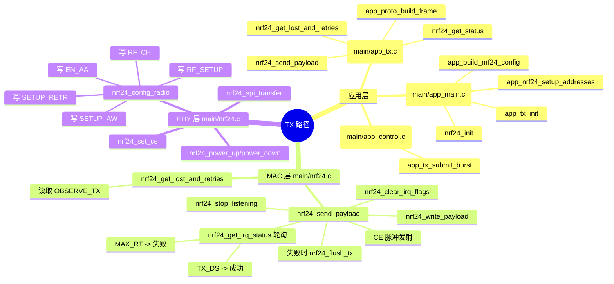
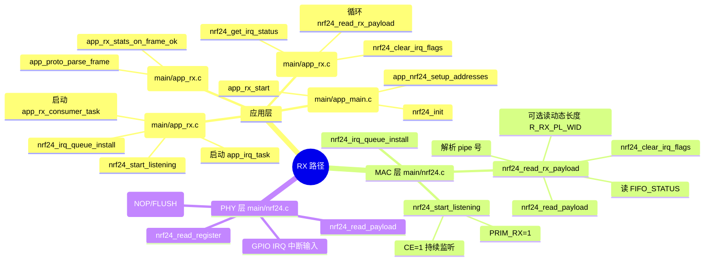

# NRF24 TX/RX 通信路径思维导图（应用层 -> MAC -> PHY）

English summary: TX/RX flows are now split across `app_tx.c`, `app_rx.c`, `app_proto.c`, and `nrf24.c` for readability.
英文摘要：TX/RX 逻辑已拆分到 `app_tx.c`、`app_rx.c`、`app_proto.c` 与 `nrf24.c`，便于阅读。

---

## 1. 分层定义（针对本项目）

- 应用层
  - 负责命令解析、业务帧构造、统计与日志
  - 文件：main/app_main.c、main/app_control.c、main/app_tx.c、main/app_rx.c、main/app_proto.c、main/app_stats.c、main/app_wifi_control.c
- MAC 层（驱动流程层）
  - 负责发包流程、ACK/重发结果判断、IRQ/FIFO 读写策略
  - 文件：main/nrf24.c
- PHY 层（射频与寄存器层）
  - 负责信道、速率、功率、地址宽度、CRC、CE 时序
  - 文件：main/nrf24.c

注意：当前实现是“固定信道 + auto-ack + auto-retry”，不是完整 CSMA/CA。

---

## 2. TX 路径思维导图

---

## 3. RX 路径思维导图

---

## 4. 关键函数清单（按文件）

### 4.1 应用层模块

- main/app_main.c
  - app_main
  - app_build_nrf24_config
  - app_nrf24_setup_addresses
- main/app_control.c
  - app_control_handle_line
- main/app_tx.c
  - app_tx_task
  - app_tx_submit_burst
- main/app_rx.c
  - app_rx_start
  - app_irq_task
  - app_rx_consumer_task
- main/app_proto.c
  - app_proto_build_frame
  - app_proto_parse_frame
- main/app_stats.c
  - app_stats_tx / app_stats_rx

### 4.2 main/nrf24.c（MAC + PHY 核心）

- 初始化与射频参数
  - nrf24_init
  - nrf24_config_radio
  - nrf24_config_retransmit
- TX 关键路径
  - nrf24_send_payload
  - nrf24_get_irq_status
  - nrf24_flush_tx
- RX 关键路径
  - nrf24_start_listening
  - nrf24_read_rx_payload
  - nrf24_clear_irq_flags
- 底层访问
  - nrf24_spi_transfer
  - nrf24_read_register / nrf24_write_register
  - nrf24_set_ce

---

## 5. 建议测试矩阵（直接可执行）

### 5.1 ACK 与重发测试

- 变量
  - auto-ack: 开/关
  - retr_count: 0/3/10/15
  - retr_delay_us: 250/750/1500
- 观察指标
  - TX: ack_ok, ack_fail, retries_sum, retries_max
  - RX: frame_ok, crc_fail, gap, dup, ooo

### 5.2 速率与稳定性测试

- 变量
  - data_rate: 250K / 1M / 2M
  - pa_level: -18/-12/-6/0 dBm
- 观察指标
  - 同样发送次数下，ack_fail 与 seq_gap 的变化

### 5.3 “监听信道”实验（非标准 CSMA）

- 修改位置
  - main/nrf24.c 的 nrf24_send_payload
- 实验逻辑
  - 发送前读 RPD
  - 若 RPD=1（疑似忙）则随机退避 N ms 后重试
- 验证方法
  - 在同信道增加干扰源，对比添加前后的 ack_fail 与 retries_sum
